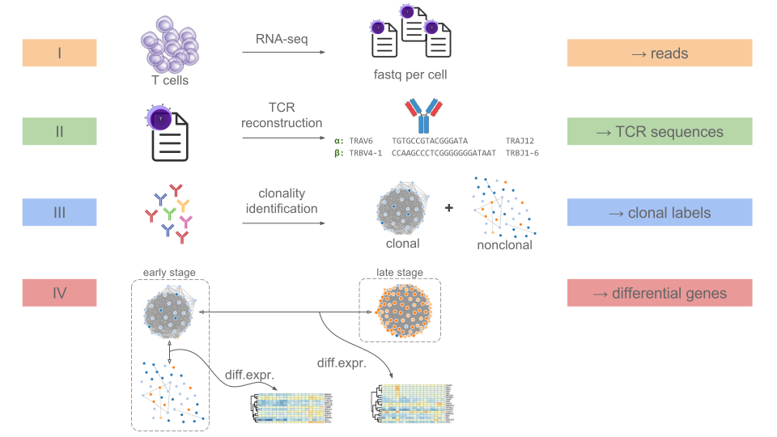

#  Gene-level analysis of lymphocyte single-cell RNA data based on a clonality specification language

**CellDive** ([src/](src/)) is a tool for exploring clonality of lymphocytes and differential expression based on single-cell RNA-seq:
* **clonality rules** specification based on the alpha and beta chains of T-cell and B-cell receptors (TCR and BCR)
* **clustering** into `main-clone`, `related-to-main-clone`, `bystander groups` and `single bystanders` based on the clonal rules
* **bipartite graph visualization** of the full clonality information from the samples
* **differential expression (DE)** between specified clones within the same sample (no batch effects!)
* **gene sets** overview accross samples and DE methods

CellDive has been applied ([example/](example/)) to a dozen of human cutaneous lymphoma samples. The clonality rules were used to partition each sample into a malignant clone (`main-clone`) and healthy cells (`bystanders`). Differential expression analyses was applied to the two clusters (no batch effect).

## Workflow:

## Contributions

Pesho Ivanov (advisor Martin Vechev), Software Reliability Lab, ETH Zurich:
* code and execution
* alpha and beta chain language rules for specifying clones
* bipartite graph with cells as edges

Data used to produce [example/](example/), Department of Dermatology, University Hospital Zurich:
* Yun-Tsan, Desislava Ignatova, Emmanuella Guenova

Note: The code has been written in 2017--2018 so it may be outdated.
